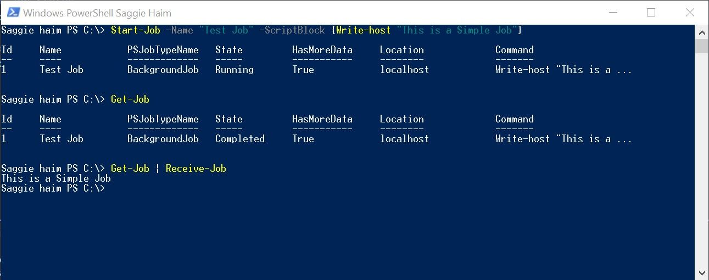
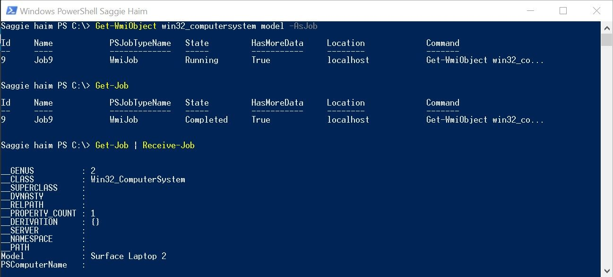
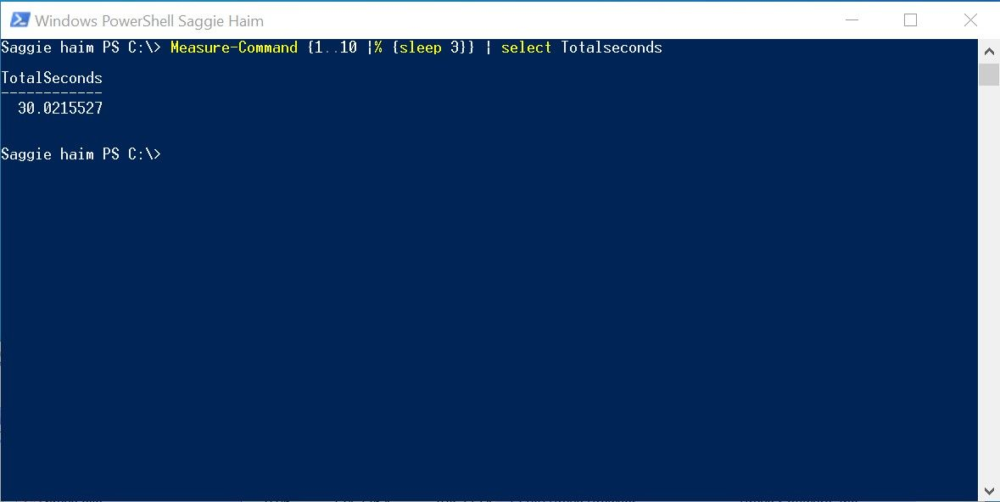
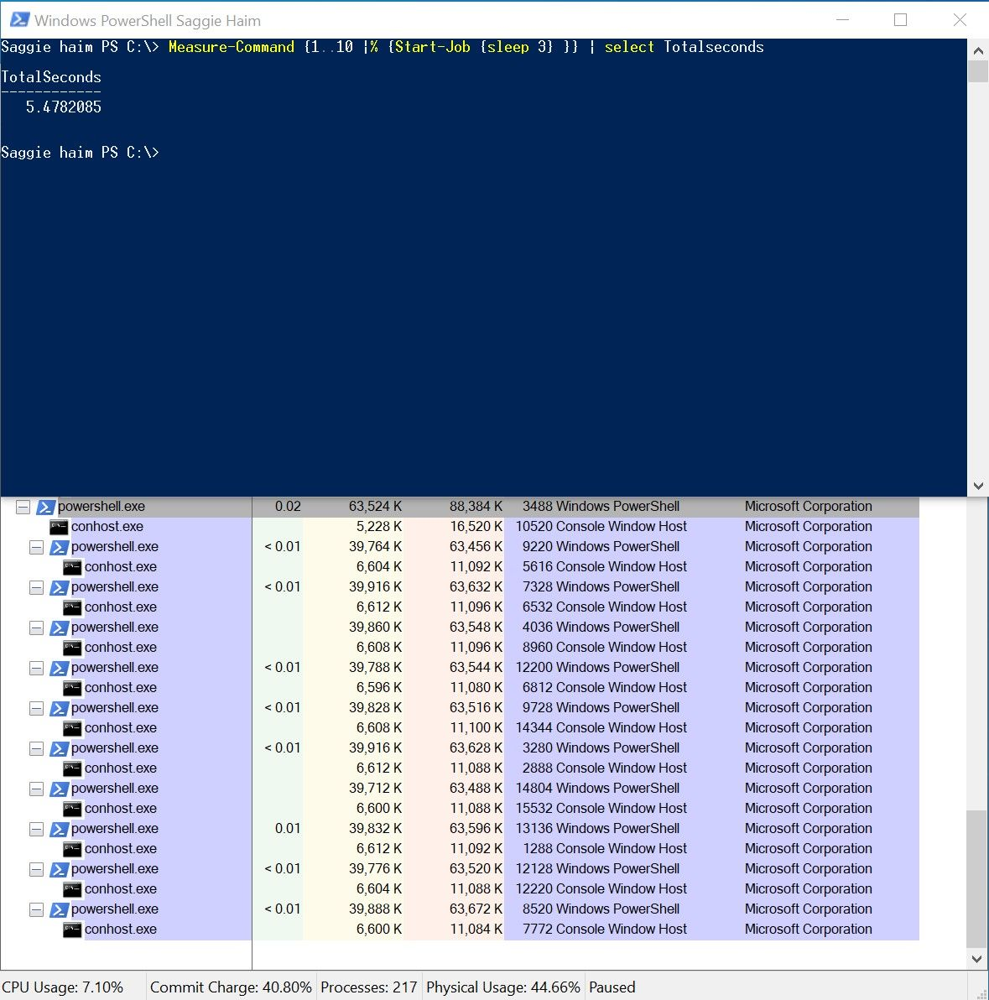
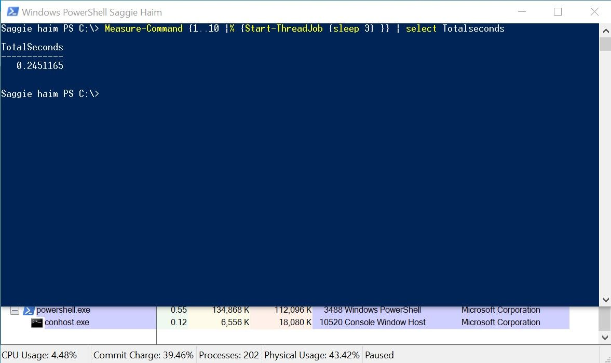

+++
author = "Saggie Haim"
title = 'Background Jobs Start Threadjob vs Start Job'
date = 2019-07-07
draft = false
image = "/images/backgroundjobcover.jpg"
description = "PowerShell can run background jobs with the Start-Job cmdlet. Most of the cmdlet also have -AsJob switch to instantly run the cmdlet as a background job. Each job runs a cmdlet in the background without interacting with the current session."
toc = true
tags = [
    "PowerShell"
]
categories = [
    "Guide",
    "PowerShell"
]
keywords = [
    "PowerShell background jobs",
    "Start-ThreadJob vs Start-Job",
    "PowerShell threading",
    "PowerShell Start-Job",
    "PowerShell Start-ThreadJob",
    "Background job management",
    "PowerShell parallel processing",
    "PowerShell job automation",
    "IT administration PowerShell",
    "PowerShell scripting",
    "PowerShell performance comparison",
    "PowerShell cmdlets",
    "Automate background tasks",
    "PowerShell job execution",
    "Thread-based jobs in PowerShell",
]
+++

PowerShell can run background jobs with the Start-Job cmdlet.
Most of the cmdlet also have -AsJob switch to instantly run the cmdlet as a background job. Each job runs a cmdlet in the background without interacting with the current session. This gives us the ability to perform an action on many targets quicker.
This also come with some “downsides”, it’s resource consuming (depend on how many tasks running in the background) as each job is a separated process.

With this in mind, another parallel solution was needed. Threadjob module extends the existing PowerShell BackgroundJob, providing faster and lighter resource consuming while running in the current PowerShell session.

I choose to write about ThreadJob because this is the adopted solution by the PowerShell Team, but you may find other modules doing the same.

## Why background jobs?

By default, PowerShell does synchronous execution. Which means that PowerShell will execute one line of code at a time. With background jobs, we can run different lines of code at the same time (Asynchronous).

For the most parts, we’ll run background jobs each time we have repetitive tasks for numerous targets.
For example, changing the Active Directory manager attribute for many users, creating a mailbox for list of users, or running the same cmdlet on many servers.

### Start-Job Or Start-ThreadJob?

The answer to this question is very simple and straightforward:

**Start-Threadjob** – When we want to run tasks in the same context. Has better performance.

**Start-Job** – When we need to run something out of the process context. For example, updating PowerShell help in the background. More resources used.

## Background Jobs with Start-Job

The Start-Job cmdlet will start a background job. We can use it in the following way:

```PowerShell
## Start a new Job
Start-Job -Name "Test Job" -ScriptBlock {Write-host "This is a Simple Job"} 

## Get Job status
Get-Job 

## Receive Job 
Get-Job | Receive-Job
```



Additionally, as I said in the beginning, Some cmdlet has -Asjob switch. Use Get-Help to check if your cmdlet has the -Asjob switch.

```PowerShell
## Use -AsJob switch to start a new Job
Get-WmiObject win32_computersystem model -AsJob 

## Get Job status
Get-Job 

## Receive Job output
Get-Job | Receive-Job
```



Update: Thanks to [@jkavanagh58](https://twitter.com/jkavanagh58) who raised the option to find cmdlet with -Asjob switch with the Get-Command cmdlet.

```PowerShell
Get-Command -ParameterName AsJob
```

## Background Jobs with Start-ThreadJob

While Threadjob doesn’t have -AsThread switch.
Everything else is just the same.
We use the Start-Threadjob cmdlet and manage the rest same as Start-Job.
If you don’t use the latest PowerShell Core, you’ll need to install the module first:

```PowerShell
Install-Module -Name ThreadJob -Scope CurrentUser
```

Afterwards, we will be able to use the Start-ThreadJob cmdlet:

```PowerShell
## Start a new Thread
Start-ThreadJob -Name "Test Thread" -ScriptBlock {Write-Host "This is a Simple Thread Job"} 

## Get Job status
Get-Job 

## Receive Job output
Get-Job | Receive-Job
```


## Start-Job vs Start-ThreadJob – Performance

We learn how to use background jobs and why. Now I want to show you the performance differences.

```PowerShell
Measure-Command {1..10 | ForEach-Object {sleep 3}} | Select-Object Totalseconds
```

This code will pause the shell for 3 seconds ten times.
I’ll run the same code three times with the following conditions:

- As is with no background jobs
- With Start-Job
- With Start-ThreadJob

During the tests, we’ll see the difference in each condition. The impact on the operating system and how long it took to execute.

### No Background jobs

Starting with the obvious, the default behavior when we don’t use any background job.



Running ten times and pausing for three seconds each time, set the benchmark to 30 seconds as expected.

### Start-Job Performance

Now, running with the native Start-Job, we can see the increased performance as it took only 5.4 seconds to finish.



However, with each iterate, a new PowerShell process started.
What will happen if we iterate 1 million times?

### Start-ThreadJob Performance

Last, we use Start-Threadjob.
This time finishing in 0.245 seconds!



Opposite to the Start-Job method, this time, we stayed in the same process.

## Conclusion

While using background jobs in the shell is not a common act.
It’s not the case when writing scripts. Some times we do care about the performance aspects, and Background jobs can help us.
We saw both methods and talked about when we use each method.
Now it’s your time to get familiar with the solutions and speed up your scripts!

Hope you enjoyed this post!
