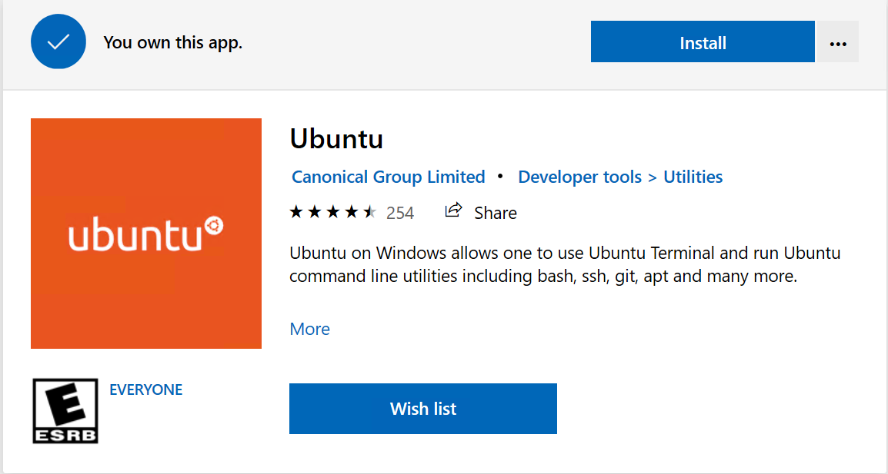
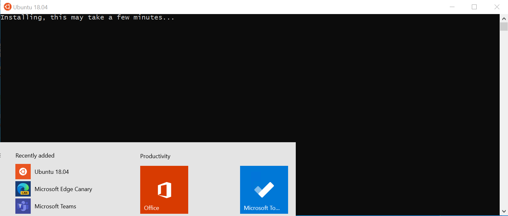
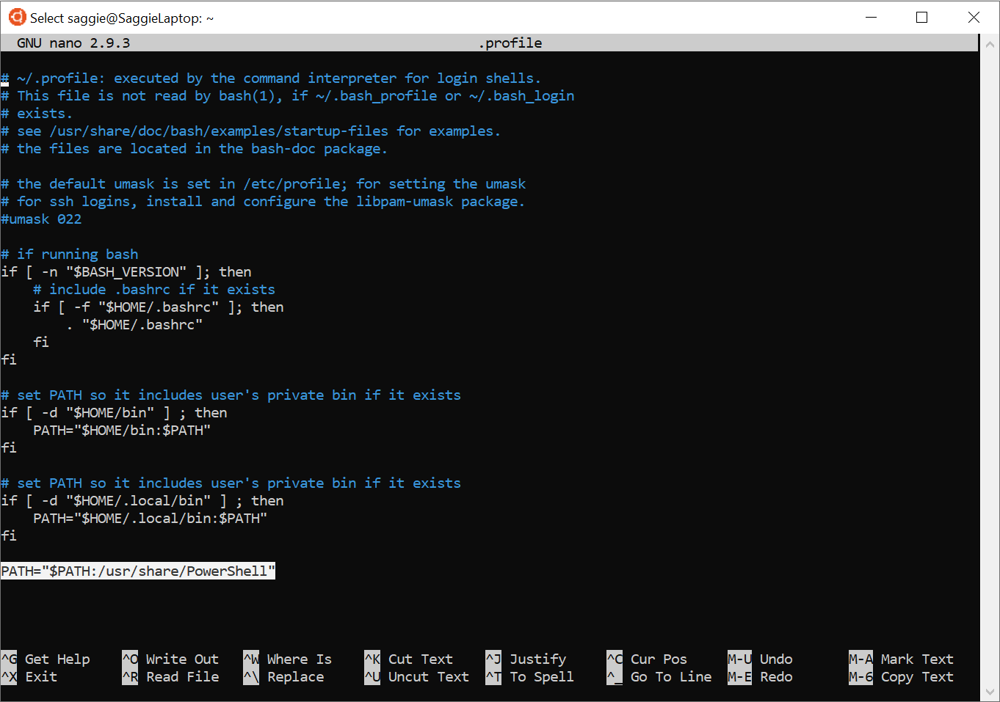
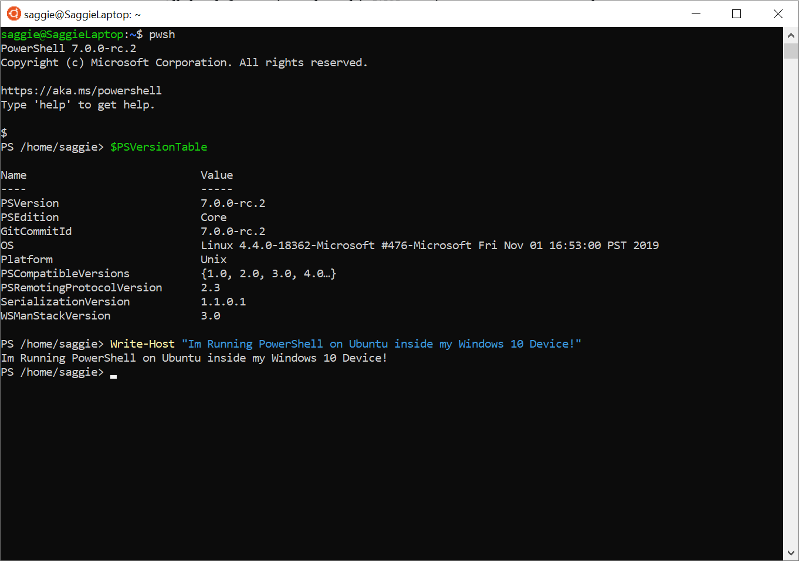

+++
author = "Saggie Haim"
title = 'Install Powershell 7 on Wsl and Ubuntu'
date = 2020-02-16
draft = false
description = "WSL or Windows Subsystem for Linux, is a feature that let us run  full Linux distributions on top of our Windows OS without the overhead of running a virtualization tools."
toc = true
tags = [
    "PowerShell",
    "Linux",
    "WSL",
]
categories = [
    "PowerShell",
    "WSL",
]
keywords = [
    "Install PowerShell 7",
    "PowerShell 7 on WSL",
    "PowerShell 7 on Ubuntu",
    "WSL PowerShell installation",
    "PowerShell 7 tutorial",
    "PowerShell 7 commands",
    "Linux PowerShell 7",
    "WSL and Ubuntu integration",
    "Install PowerShell on Linux",
    "PowerShell scripting on WSL",
    "Cross-platform PowerShell",
    "DevOps with PowerShell",
    "Windows Subsystem for Linux PowerShell",
    "IT administration with PowerShell",
]
image = "/images/psonwslcover.jpg"
+++

With PowerShell 7, we get the best PowerShell edition, most importantly, it’s cross-platform!
While last time we installed the latest PowerShell 7 on a container, sometimes we don’t want just a plain environment with PowerShell, sometimes we want a to add other tools, change system configurations or use different Linux Distros.

That is why we use WSL.

## What is WSL?

WSL or Windows Subsystem for Linux is a feature that lets us run full Linux distributions on top of our Windows OS without the overhead of running virtualization tools.

## Prerequisites

In order to enable WSL in your Windows 10, You must run Windows 10 Build 16215 or later.

## Enable WSL

First, we need to enable WSL. WSL is an optional feature in Windows and not enabled by default.
To enable it, open PowerShell as Administrator and run the following command:

```PowerShell
Enable-WindowsOptionalFeature -Online -FeatureName Microsoft-Windows-Subsystem-Linux
```


Confirm and restart your Computer

## Installing A Linux Distribution

Now, that we enabled WSL on our system, its time to install a Linux Distribution.
We can do it by the Microsoft Store or with PowerShell.

### Install Linux Distribution from Store

To install a Linux distribution from Microsoft Store, follow the following steps:

1. Open Microsoft Store
2. Search for Ubuntu
3. Click on Get or Install (if you already had it)



### Install WSL Linux Distribution With PowerShell

Similarly, we can install a Linux distribution with PowerShell (The only way to install it on LTSC edition).
To do it, we first need to download the appx, in this example, we will download Ubuntu:

```PowerShell
Invoke-WebRequest -Uri https://aka.ms/wsl-ubuntu -OutFile Ubuntu.appx -UseBasicParsing
```

Now we can use the Add-AppxPackage cmdlet to install our distribution:

```PowerShell
Add-AppxPackage .\Ubuntu.appx
```


You can find more Linux distributions on [Microsoft Docs](https://docs.microsoft.com/en-us/windows/wsl/install-manual#downloading-distros)

### Starting Ubuntu with WSL

Now, we can finally start our Ubuntu for the first time.
If you downloaded it from the Store, you can press on Lunch, if you installed in with PowerShell you can find it under the **Start Menu**.



After WSL finish installing our Ubuntu, it will ask us to set up Username and Password for our root user, go ahead and fill in yours.


**TIP**: you can now launch Ubuntu directly from your PowerShell session with **wsl.exe**

## Installing PowerShell 7

After all the work, we arrived to the fun part.
We now Installing PowerShell 7 on our Ubuntu. There are four steps for this process, so let’s begin.

first, we need to create a folder to store our PowerShell files, we will store it on /usr/share, but feel free to use any path you like.

```bash
# Create Folder
sudo mkdir /usr/share/PowerShell
# Change Working Dir
cd /usr/share/PowerShell
```

Now we will download the latest PowerShell 7 build (RC.2 to this time of writing)

```bash
sudo wget https://github.com/PowerShell/PowerShell/releases/download/v7.0.0-rc.2/powershell-7.0.0-rc.2-linux-x64.tar.gz
```

The file we downloaded is zipped so we need to unzip it, we can do it by running:

```bash
sudo tar xzvf powershell-7.0.0-rc.2-linux-x64.tar.gz
```

The last step is to add this folder to the environmental path.
This will allow us to run pwsh from anywhere in our OS and won’t require us to specify the full path.
To do so, we need to edit our user profile file, it’s a file named **.profile** that sit in our **#HOME** directory.

```bash
# Navigate to home directory
cd #HOME 
# Edit the .profile file
nano .profile
```

Add the following line in the end of the file:

```bash
PATH="$PATH:/usr/share/PowerShell"
```



All that left now, is to restart WSL, and run **pwsh**!
congrats, you just run PowerShell 7 on Ubuntu inside your Windows 10 device!



### Clean up

Now that we finished installing our PowerShell, we can remove the zipped file by running:

```bash
sudo rm /usr/share/PowerShell/powershell-7.0.0-rc.2-linux-x64.tar.gz
```

## Conclusion

In this post, we added another tool to our toolbox, as we now know how to install and configure WSL and how to install and set up PowerShell 7 on it.
Use it when you want to test your cross-platform scripts or modules, or to explore the differences between each OS.

I hope you learn a new thing today and enjoyed this post!
